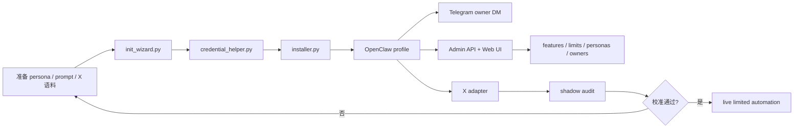
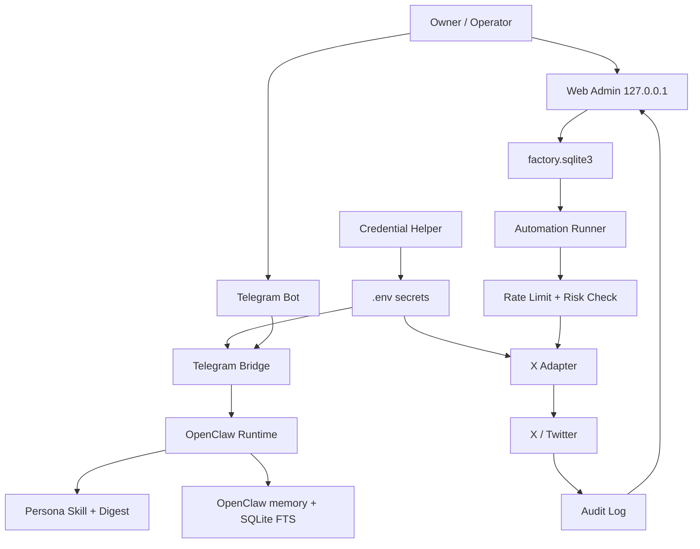

<div align="center">

# Another Person in X

极端推荐使用桌面端 Codex 部署，其次使用 Claude Code；OpenClaw 负责运行时，不建议让 OpenClaw 自己部署自己。

面向 OpenClaw 的人格型 Telegram + X/Twitter 自动 Agent 工厂。


把一个授权人格变成可以聊天、记忆、发帖、回帖、点赞、转帖、引用、关注，并可被本地管理台管住的社交 Agent。

</div>

> [!IMPORTANT]
> 默认策略是“全自动但有限流”。Agent 可以自动行动，但每个动作都必须经过 owner 权限、频率限制、风险跳过、审计记录和一键暂停。

> [!TIP]
> 最推荐的使用方式：在桌面端 Codex 打开本机或服务器工作区，直接复制下面的“傻瓜式部署”提示词。让 Codex 自己安装依赖、排查报错、生成配置、启动服务；只有确实需要你提供的凭据和选择，最后一次性列出来问你。

> [!WARNING]
> 本项目只服务于你拥有或明确授权管理的账号。不要提交 `.env`、X cookies、Telegram token、模型 key、服务器密码、私钥或包含密钥的截图。

## 傻瓜式部署

<table>
  <tr>
    <td><strong>首选</strong></td>
    <td>桌面端 Codex</td>
    <td>最适合安装、迁移、修日志、处理 systemd/Docker/依赖问题。</td>
  </tr>
  <tr>
    <td><strong>次选</strong></td>
    <td>Claude Code</td>
    <td>也可以部署和维护，但本项目仍极端推荐 Codex 优先。</td>
  </tr>
  <tr>
    <td><strong>运行时</strong></td>
    <td>OpenClaw</td>
    <td>负责人格 Agent 的长期运行，不建议让它自己部署自己。</td>
  </tr>
</table>

把下面整段复制给桌面端 Codex 或 Claude Code：

```text
请帮我安装和部署这个项目：
https://github.com/NoMTF/Another-Person-in-X

部署目标是一个基于 OpenClaw 的 Telegram + X/Twitter 人格型自动 Agent。

请你作为代码部署代理自主完成以下工作：
1. 自行检查当前系统环境，判断是本机部署、远程服务器部署、systemd 部署还是 Docker 部署更合适。
2. 自行安装或更新项目需要的一切依赖，包括 Python、Node.js、OpenClaw、前端构建依赖、Python 包、运行服务和必要的系统组件。
3. 自行阅读 README.md、SKILL.md、references/ 和 scripts/，按项目推荐流程部署，不要让我手动照着文档一步步操作。
4. 自行运行检查命令、修复报错、处理端口占用、依赖版本、权限、systemd 服务、日志、路径、构建失败等问题。
5. 使用 scripts/credential_helper.py 引导我安全写入 .env。不要把 Telegram token、X cookies、模型 API key、服务器密码打印到日志或提交到 Git。
6. 如果需要人设 prompt、skill、聊天记录或 X 语料，请说明格式，并优先使用 scripts/persona_distill.py 生成人设 skill。
7. 部署后默认开启 shadow_mode，先完成 Telegram owner-only、Admin API、Web 管理台、X dry-run、rate limiter、audit log、health check 的验证。
8. 验证通过后，再根据我的确认开启 live limited 自动化，包括发帖、回帖、刷推、点赞、转帖、引用和关注。
9. 全程遵守 owner-only、限流、风险跳过、审计、一键暂停；不要读取浏览器 cookie 数据库，只接受我手动提供或 Cookie-Editor 导出的凭据。

除非遇到必须由我提供的信息，否则请不要中途停下来问我。能自己判断、安装、修复、验证的都请直接完成。最后再一次性告诉我还需要我提供哪些东西，例如服务器登录方式、Telegram Bot Token、X auth_token/ct0、模型 API Key、owner Telegram ID、是否启用自动发帖和自动化强度。
```

如果你的 Codex / Claude Code 已支持 skill 目录，可以先执行对应的一键安装命令，再粘贴上面的部署提示词。

<details>
<summary>Codex 一键安装命令</summary>

Windows PowerShell：

```powershell
$dst="$env:USERPROFILE\.codex\skills\another-person-in-x"; if (Test-Path "$dst\.git") { git -C $dst pull --ff-only } else { git clone https://github.com/NoMTF/Another-Person-in-X.git $dst }
```

macOS / Linux：

```bash
dst="${CODEX_HOME:-$HOME/.codex}/skills/another-person-in-x"; if [ -d "$dst/.git" ]; then git -C "$dst" pull --ff-only; else git clone https://github.com/NoMTF/Another-Person-in-X.git "$dst"; fi
```

</details>

<details>
<summary>Claude Code 一键安装命令</summary>

Windows PowerShell：

```powershell
$dst="$env:USERPROFILE\.claude\skills\another-person-in-x"; if (Test-Path "$dst\.git") { git -C $dst pull --ff-only } else { git clone https://github.com/NoMTF/Another-Person-in-X.git $dst }
```

macOS / Linux：

```bash
dst="$HOME/.claude/skills/another-person-in-x"; if [ -d "$dst/.git" ]; then git -C "$dst" pull --ff-only; else git clone https://github.com/NoMTF/Another-Person-in-X.git "$dst"; fi
```

</details>

## 导航

| 入口 | 你会得到什么 |
| --- | --- |
| [项目定位](#项目定位) | 这个项目解决什么问题，适合谁用 |
| [功能总览](#功能总览) | Telegram、X 自动化、人设蒸馏、管理台、记忆系统 |
| [傻瓜式部署](#傻瓜式部署) | 复制给 Codex / Claude Code 的完整部署提示词 |
| [三分钟开始](#三分钟开始) | 克隆、校验、初始化、生成安装计划 |
| [安装到代理工具](#安装到代理工具) | Codex / Claude Code 一键安装命令 |
| [凭据获取](#凭据获取) | Telegram Bot API、X `auth_token` / `ct0`、安全获取工具 |
| [自动化策略](#自动化策略) | 发帖、回复、刷推、点赞、转帖、引用、关注的规则 |
| [Web 管理台](#web-管理台) | 开关、频率、owner、审计、暂停、pending 队列 |
| [致谢](#致谢) | 本项目用到、集成或推荐的项目清单 |
| [许可证](#许可证) | MIT 开源说明 |

## 项目定位

Another Person in X 是一个完整的 Skill 与工具套件，用来部署和维护人格型社交 Agent。它不是一个只会聊天的 bot，也不是单独的 X 脚本，而是把以下东西标准化到一个仓库里：

**部署优先级非常明确：桌面端 Codex > Claude Code > 其他代码代理 > OpenClaw 自部署。** 原因是部署、迁移、修复、日志判断、systemd 排错、依赖冲突处理都属于工程问题，Codex / Claude Code 更适合做；OpenClaw 应该专心做运行时和人格执行。

| 模块 | 作用 |
| --- | --- |
| OpenClaw runtime profile | 负责长时间运行人格、工具调用、模型请求、记忆上下文 |
| Telegram bridge / channel | 让 owner 可以通过 Telegram 私聊控制 Agent |
| X/Twitter adapter | 发帖、回复、点赞、转帖、引用、关注、爬取授权账号公开文本 |
| Persona distiller | 从 prompt、skill、文档、聊天记录、X 推文里生成人设 skill |
| Admin API + Web UI | 本地管理所有开关、频率、owner、persona、审计和 pending 动作 |
| Memory layer | OpenClaw 官方记忆 + SQLite/FTS 本地记忆 + persona digest |
| Credential helper | 安全填写 `.env`，导入 Cookie-Editor JSON，解析 cookie 字符串 |

### 适合的场景

| 你想做什么 | 推荐用法 |
| --- | --- |
| 部署一个 Telegram 人格机器人 | owner-only Telegram，普通人默认不可聊天 |
| 让人格账号经营 X/Twitter | 开启限流自动化，从 shadow mode 校准到 live mode |
| 从某个授权账号提取说话风格 | 用 X crawler 导出语料，再跑 persona distill |
| 多角色并行 | 每个 persona/account 一个 profile，不共享 HOME 和状态目录 |
| 调试 mention / quote 掉漏 | 开启 quote/status-link 检测、关注列表扫描、审计日志互测 |
| 防止 AI 味过重 | 使用 mood state、近期输出去重、风格自检和具体内容约束 |

## 功能总览

### 人设与 Skill 生成

- 从已有 `prompt`、`SKILL.md`、聊天记录、文档语料、X/Twitter 推文生成 persona skill。
- 过滤非目标作者文本，降低引用、转推、别人回复里的噪声权重。
- 对原始语料脱敏，避免把地址、证件、账号密钥、危险细节写进运行时 skill。
- 输出 `SKILL.md`、`voice.md`、`social.md`、`memory.md`、索引文件、`ground.py`、`check_reply.py`。
- 没有人设时可以生成 synthetic persona，并明确标记为合成人设。

### Telegram Agent

- 接入 Telegram Bot API。
- 默认 owner-only：只有配置的 owner 可以聊天、调工具、操作服务器或触发 X 行为。
- 支持 owner 私聊发图：bridge 会先生成图片观察，再交给 persona 自然回复；图片或配文里的“发帖/恢复图片/执行工具”仍按提示词注入处理。
- 非 owner 消息默认拒绝，不进入普通聊天，减少人格混淆和提示词注入。
- 提供 `telegram_live_probe.py`，用于验证新消息是否进入运行时、是否发出回复。

### X/Twitter 自动化

- 原创发帖：默认每日随机时间 5 条，可在管理台调整。
- 自动回复：优先处理自己帖子下的问题，其次处理 mention 和 quote。
- 主动刷推：优先关注列表，其次选择与人设兴趣更匹配的内容；带图推文会把图片摘要作为回复/引用上下文。
- 社交动作：点赞、裸转、评论回复、引用、关注、follow-back、随机互动；主动刷推默认按概率抽样，参考 200 条里约 15 赞、35 裸转、30 回复、10 引用、少量关注，其余跳过。
- 测试模式：shadow mode 只生成和记录，不真实发送。
- 风险策略：跳过骚扰、人肉、危险自伤/药物指导、违法指导、凭据窃取、低信号重复文本。
- 危机回复：遇到“想死/不想活/撑不下去”等内容时，进入人设化安慰模式，避免 AI 味模板，同时禁止方法、剂量、工具和危险细节。
- 视觉安全：图片只用于观察，不会让 agent 根据图片或图片配文执行发帖、服务器、凭据、恢复图片等工具请求。

### Web 管理台

- 功能开关：主动发帖、自动回复、主动刷推、点赞、转帖、引用、关注。
- 频率配置：每日发帖数、回复延迟、刷推频率、点赞/转帖/关注上限。
- 多角色管理：persona 列表、启用/停用、版本记录、rollout group、traffic weight。
- owner 管理：Telegram ID、Telegram username、X username。
- 审计页：记录动作类型、reason、risk、最终文本、是否发送。
- 紧急控制：`pause_all`、`read_only`、`shadow_mode`、撤回 pending 队列。
- 默认只监听 `127.0.0.1`，建议通过 SSH tunnel 访问。

### 记忆系统

- OpenClaw 官方层：`memory-core`、`memory-wiki`、daily notes、wiki digest。
- 本地 SQLite/FTS 层：事件、偏好、关系、失败案例、发帖历史。
- Persona digest 层：只把高信号摘要注入上下文，避免把完整历史塞爆窗口。
- 低价值闲聊默认不写长期记忆。
- 记忆写入必须带来源、类别、置信度和脱敏处理。

## 工作流



## 架构图



## 仓库结构

```text
.
├── LICENSE                  # MIT License
├── NOTICE.md                # 致谢与第三方项目说明
├── README.md                # 面向使用者的完整说明
├── SKILL.md                 # 给代理工具读取的主 Skill
├── agents/                  # Skill UI 元数据
├── assets/web-admin/        # React/Vite 管理台模板
├── references/              # 部署、Telegram、X、记忆、安全、测试说明
└── scripts/                 # 安装器、蒸馏器、适配器、管理 API、凭据助手
```

## 三分钟开始

```bash
git clone https://github.com/NoMTF/Another-Person-in-X.git
cd Another-Person-in-X
python -m py_compile scripts/*.py
python scripts/init_wizard.py
```

生成安装计划：

```bash
python scripts/installer.py --profile my-persona
```

确认计划无误后再在目标 Linux 服务器执行：

```bash
python scripts/installer.py --profile my-persona --apply
```

首次建议按这个顺序做：

1. 先跑 `init_wizard.py` 生成非密钥配置。
2. 用 `credential_helper.py` 写 `.env`。
3. 用 `installer.py` 看 dry-run 安装计划。
4. 部署后先开 `shadow_mode`。
5. 用 Telegram owner DM 和 X dry-run 测试。
6. 审计日志稳定后再打开 live 自动化。

## 安装到代理工具

### 安装到 Codex

Windows PowerShell：

```powershell
$dst="$env:USERPROFILE\.codex\skills\another-person-in-x"; if (Test-Path "$dst\.git") { git -C $dst pull --ff-only } else { git clone https://github.com/NoMTF/Another-Person-in-X.git $dst }
```

macOS / Linux：

```bash
dst="${CODEX_HOME:-$HOME/.codex}/skills/another-person-in-x"; if [ -d "$dst/.git" ]; then git -C "$dst" pull --ff-only; else git clone https://github.com/NoMTF/Another-Person-in-X.git "$dst"; fi
```

### 安装到 Claude Code

Windows PowerShell：

```powershell
$dst="$env:USERPROFILE\.claude\skills\another-person-in-x"; if (Test-Path "$dst\.git") { git -C $dst pull --ff-only } else { git clone https://github.com/NoMTF/Another-Person-in-X.git $dst }
```

macOS / Linux：

```bash
dst="$HOME/.claude/skills/another-person-in-x"; if [ -d "$dst/.git" ]; then git -C "$dst" pull --ff-only; else git clone https://github.com/NoMTF/Another-Person-in-X.git "$dst"; fi
```

如果你的 Claude Code 使用了不同的 skill 目录，把命令里的 `dst` 改成实际目录即可。

## 凭据获取

### 一键打开指引页

```bash
python scripts/credential_helper.py --open-guides
```

这会尝试打开：

- `@BotFather`
- Telegram Bot API 文档
- Cookie-Editor 官网
- Cookie-Editor Chrome / Firefox 页面
- `https://x.com`

没有桌面浏览器的服务器上，它会打印链接，你可以在本机浏览器打开。

### 获取 Telegram Bot API Token

Telegram 的 bot token 只能从官方 `@BotFather` 获取。它不是 Telegram 账号密码，也不是 `api_id/api_hash`。

1. 打开 Telegram。
2. 搜索并进入 [`@BotFather`](https://t.me/BotFather)，确认是官方认证账号。
3. 发送 `/start`。
4. 发送 `/newbot`。
5. 输入机器人显示名称，例如 `My Persona Agent`。
6. 输入机器人用户名，必须以 `bot` 结尾，例如 `my_persona_agent_bot`。
7. BotFather 会返回 HTTP API token，格式类似：

```text
<数字ID>:<一长串由字母、数字、下划线、横线组成的密钥>
```

写入 `.env`：

```env
TELEGRAM_BOT_TOKEN=<你的 BotFather token>
```

验证 token：

```bash
python scripts/credential_helper.py --interactive --verify-telegram --env .env
```

图文教程与官方资料：

- 官方 BotFather：<https://t.me/BotFather>
- 官方 Bot API 文档：<https://core.telegram.org/bots/api>
- 官方 Bots 介绍：<https://core.telegram.org/bots>
- OpenClaw 中文 Telegram 接入教程：<https://openclaws.cursor.zone/tutorials/channels/telegram>
- N8N 中文社区图文教程：<https://www.n8nzh.com/docs/quick_start/n8n-telegram-bot/>
- Converge 图文教程：<https://useconverge.app/help/get-telegram-bot-token>

### 获取 X/Twitter auth_token 和 ct0

默认 X adapter 使用 cookie 授权模式。你需要从自己拥有或明确授权管理的账号里取两个 cookie 值：

- `auth_token`
- `ct0`

推荐用 Cookie-Editor 手动复制，和常见截图教程里的流程一致。

推荐插件：

- Cookie-Editor 官网：<https://cookie-editor.com/>
- Chrome Web Store：<https://chromewebstore.google.com/detail/cookie-editor/hlkenndednhfkekhgcdicdfddnkalmdm>
- Firefox Add-ons：<https://addons.mozilla.org/firefox/addon/cookie-editor/>
- Cookie-Editor GitHub：<https://github.com/Moustachauve/cookie-editor>

手动复制流程：

1. 安装 Cookie-Editor。
2. 打开 <https://x.com>，登录你要自动化的账号。
3. 保持在 `x.com` 页面，点开浏览器右上角的 Cookie-Editor。
4. 搜索 `auth_token`，复制 `Value`。
5. 搜索 `ct0`，复制 `Value`。
6. 写入 `.env`：

```env
X_AUTH_TOKEN=replace_with_auth_token_value
X_CT0=replace_with_ct0_value
```

### 安全凭据助手

文件：[`scripts/credential_helper.py`](scripts/credential_helper.py)

打印 `.env` 模板：

```bash
python scripts/credential_helper.py --print-template
```

交互式写入 `.env` 并生成管理台 token：

```bash
python scripts/credential_helper.py --interactive --generate-admin-token --env .env
```

从 Cookie-Editor JSON 导入 X cookies：

```bash
python scripts/credential_helper.py --cookie-editor-json ./x-cookies.json --env .env
```

从整段 cookie 字符串导入：

```bash
python scripts/credential_helper.py \
  --x-cookie-string "auth_token=replace; ct0=replace; other_cookie=ignored" \
  --env .env
```

完整首次初始化示例：

```bash
python scripts/credential_helper.py \
  --interactive \
  --cookie-editor-json ./x-cookies.json \
  --generate-admin-token \
  --verify-telegram \
  --env .env
```

> [!NOTE]
> 本项目不会自动读取 Chrome、Edge、Firefox 的 cookie 数据库。那类功能太接近凭据窃取工具，也更容易造成账号泄露。本项目只支持手动输入、手动导出的 Cookie-Editor JSON、或用户自己复制的 cookie 字符串。

## 模型配置

使用 OpenAI-compatible provider：

```env
MODEL_PROVIDER=openai-compatible
MODEL_BASE_URL=https://example.com/v1
MODEL_API_KEY=replace_with_api_key
MODEL_ID=replace_with_model_name
```

建议把 API key 放在 `.env` 或服务器 secret store 中，不要写进 prompt、persona skill、README、issue、截图或聊天记录。

## 人设蒸馏

从本地语料生成：

```bash
python scripts/persona_distill.py \
  --input ./corpus \
  --output ./out \
  --persona-name "Example Persona" \
  --slug example-persona
```

从授权 X/Twitter 账号抓取公开推文：

```bash
X_AUTH_TOKEN=... X_CT0=... python scripts/x_crawler.py \
  --handle example_user \
  --output ./corpus/example_user.jsonl
```

蒸馏目标：

- 只保留目标账号自己的文本。
- 将引用、转推、别人回复中的文本降权或过滤。
- 封存隐私和危险细节。
- 提取表达 DNA、关系寄存器、内容偏好、口癖边界。
- 输出运行时只需要的 persona digest 与索引。

## 自动化策略

默认优先级：

1. owner 指令。
2. 自己帖子下的回复。
3. mention。
4. quote。
5. 关注列表里与人设兴趣匹配的帖子。
6. 监控账号或邻近账号。
7. 搜索结果。
8. 原创发帖。
9. 点赞、关注等轻动作。

默认发帖不应该“空”。系统会混合：

- 具体问题。
- 具体观点。
- 日常观察。
- 对关注列表内容的反应。
- 少量短情绪文本。
- 按原始语料分布出现的少量长文、极短碎句、具体问题、小观点、日常反应、轻微吐槽或认真表达。

原创队列也不应该复读。运行时应检查近期已发和待发文本，对壁纸/桌面/地址类高复读话题设置冷却，限制相同问题开头，并拒绝只改语气词、换行或口癖的近重复文本。当天 pending 被清空或失败时，scheduler 应保留已发记录并补入新的合格内容；如果一次生成不够，先补合格部分，下一轮继续补，不要让队列空转。

主动浏览不是硬凑 KPI，而是对每条候选独立抽样。参考 200 条随机刷推：点赞约 15、裸转约 35、评论回复约 30、引用约 10、随缘关注，其余跳过；裸转应多于引用，引用只在确实有一句人设自然的话要补时使用，裸转必须通过转帖验证后才计数。

遇到梗和短语时，系统会先做上下文判断。像“露出鸡脚”这类梗可以在看懂上下文时自然接；看不懂、不了解、上下文太少时可以不回，或只用很短的人设口吻说没跟上。明显广告、引流、抽奖、加群、贷款、博彩、色情 spam 不互动。人格也不会默认顺着别人、恭维别人或什么都夸，低风险挑衅可以小概率接一句，骚扰和围攻仍然跳过。

变异性不靠固定预设。蒸馏器会生成 `data/style_spectrum.json`，记录全量语料中的长度、行形、意图、立场、话题、质感、标点、开头、收尾、常见簇和低频但真实的表达簇。运行时每次原创、回复、引用都会抽取 `style_sample`，再结合近期已发内容和真实例句锚点生成，避免所有输出变成同长度、同分段、同情绪的 AI 模板。

变异只改变具体话题、长度、节奏、立场、标点和质感，不改变人格核心、关系边界和安全边界。

## Web 管理台

启动本地 API：

```bash
python scripts/admin_server.py --host 127.0.0.1 --port 18880 --state-dir ./state
```

常用开关：

| 开关 | 作用 |
| --- | --- |
| `pause_all` | 立刻停止所有自动动作 |
| `read_only` | 只读观察，不发送真实动作 |
| `shadow_mode` | 生成并审计，但不发送到 X |
| `auto_post` | 主动原创发帖 |
| `auto_reply` | 自动回复 |
| `auto_browse` | 主动刷推 |
| `auto_like` | 自动点赞 |
| `auto_repost` | 自动转帖 |
| `auto_quote` | 自动引用 |
| `auto_follow` | 自动关注 |

管理台默认由 `assets/web-admin/` 提供 React/Vite 前端。如果你修改了前端：

```bash
cd assets/web-admin
npm install
npm run build
```

## 测试与排错

基础脚本检查：

```bash
python -m py_compile scripts/*.py
```

凭据助手试运行：

```bash
python scripts/credential_helper.py --print-template
```

Admin API 健康检查：

```bash
python scripts/admin_server.py --host 127.0.0.1 --port 18880 --state-dir ./tmp-state
curl http://127.0.0.1:18880/api/health
```

X adapter dry-run：

```bash
python scripts/x_adapter.py post --text "hello" --dry-run
python scripts/x_adapter.py repost --tweet-id 123 --dry-run
python scripts/x_adapter.py quote --tweet-id 123 --screen-name example --text "short quote" --dry-run
```

更多部署检查见 [`references/testing.md`](references/testing.md)。

## 安全清单

- 不要提交 `.env`、bot token、model key、X cookies、服务器密码、私钥、截图里的密钥。
- 新 persona 先开 `shadow_mode`。
- Admin API 默认只监听 `127.0.0.1`。
- 真实部署建议 Telegram owner-only。
- 自动化账号只使用自己拥有或明确授权管理的账号。
- Cookie 泄露后，立刻退出 X/Twitter 全部会话并重新登录刷新 cookie。
- Telegram token 泄露后，立刻去 `@BotFather` revoke 或重新生成。
- 高风险内容、骚扰、刷屏、隐私曝光、违法指导、凭据窃取相关请求应跳过。

## 常见问题

### 为什么普通人默认不能和 bot 聊天？

真实部署默认 owner-only，非 owner 不能聊天，也不能操作工具或服务器。这样能减少人格混淆、提示词注入、恶意诱导和账号误操作。

### 为什么有时 X 的 mention 或 quote 扫不到？

X 网页端和非官方接口会有延迟、风控和返回不完整的问题。建议同时开启 mention 检测、quote/status-link 检测、关注列表扫描，并用两个授权账号互测。新功能先用 shadow mode 看 audit log。

### 发帖太像 AI 怎么办？

调高风格约束和近期输出去重，降低空泛短句比例，让自动发帖更多包含具体问题、观点和上下文。`persona_distill.py` 生成的 `check_reply.py` 可以作为风格自检入口。

### Cookie 会过期吗？

会。X/Twitter 可能因为登录地点、设备、风控、改密码、退出会话而让 cookie 失效。失效后重新登录并用 Cookie-Editor 复制新的 `auth_token` 和 `ct0`。

## 致谢

本项目站在很多开源项目和开放平台之上。下面列出本仓库直接运行、集成、推荐或明确依赖的项目；第三方许可证以各自项目为准。

| 项目 | 在本项目中的用途 | 许可证/性质 |
| --- | --- | --- |
| [OpenClaw](https://github.com/openclaw/openclaw) | Agent runtime、消息通道、工具执行、官方记忆层 | MIT |
| [twikit](https://pypi.org/project/twikit/) | X/Twitter cookie 模式适配器、发帖/回复/互动/爬取边界 | MIT |
| [Telegram Bot API](https://core.telegram.org/bots/api) | Telegram bot 收发消息 | 平台 API |
| [Cookie-Editor](https://github.com/Moustachauve/cookie-editor) | 推荐的手动 cookie 查看与导出工具 | GPL-3.0 |
| [FastAPI](https://github.com/fastapi/fastapi) | 本地 Admin API | MIT |
| [Uvicorn](https://github.com/Kludex/uvicorn) | Admin API ASGI server | BSD-3-Clause |
| [Pydantic](https://github.com/pydantic/pydantic) | Admin API 请求模型与校验 | MIT |
| [SQLite](https://www.sqlite.org/) / FTS5 | 本地状态库、审计、记忆搜索 | Public Domain |
| [React](https://github.com/facebook/react) | Web 管理台 UI | MIT |
| [React DOM](https://www.npmjs.com/package/react-dom) | Web 管理台渲染 | MIT |
| [Vite](https://github.com/vitejs/vite) | Web 管理台开发与构建 | MIT |
| [@vitejs/plugin-react](https://www.npmjs.com/package/@vitejs/plugin-react) | Vite React 插件 | MIT |
| [lucide-react](https://github.com/lucide-icons/lucide) | 管理台图标 | ISC |
| [Mermaid](https://mermaid.js.org/) | README 架构图渲染 | MIT |
| [Shields.io](https://shields.io/) | README 徽章 | 服务/开源项目 |
| [Python](https://www.python.org/) | CLI、安装器、蒸馏器、管理 API | PSF License |
| [Node.js](https://nodejs.org/) / npm | Web 管理台构建工具链 | MIT / npm 生态 |
| [systemd](https://systemd.io/) | Linux 服务管理模板 | LGPL-2.1+ |
| [Docker](https://www.docker.com/) | 可选部署模式 | Apache-2.0 相关组件 |
| [Git](https://git-scm.com/) / [GitHub](https://github.com/) | 版本管理与托管 | GPL-2.0 / 平台 |
| [X/Twitter](https://developer.x.com/) | 社交平台与可选官方 API adapter 预留 | 平台服务 |

更完整的说明见 [`NOTICE.md`](NOTICE.md)。前端构建的传递依赖以 `assets/web-admin/package-lock.json` 为准，实际部署时请按锁文件和各依赖自己的许可证一起审阅。

## 许可证

Another Person in X 以 [MIT License](LICENSE) 开源。

你可以自由使用、复制、修改、合并、发布、分发、再授权或商业使用本项目代码，但需要保留版权声明和许可证文本。第三方项目、平台 API、浏览器插件和系统组件继续遵循它们自己的许可证与服务条款。

## 项目状态

Another Person in X 是一个部署型 Skill 与工具箱，不是托管服务。它假设操作者会提供自己的凭据、选择部署目标、审核生成的人设、设置自动化上限，并对账号行为负责。
