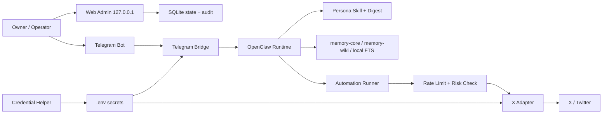

# Another Person in X


Another Person in X 是一个面向人格型社交 Agent 的完整 Skill 与工具套件。它的目标不是做一个简单聊天机器人，而是让一个经过授权的人格角色可以接入 Telegram、管理 X/Twitter 账号、长期记忆、自动发帖、自动回复、点赞、转帖、引用、关注，并且可以通过本地 Web 管理台进行开关、限流、审计和回滚。

这个项目适合用来部署 OpenClaw 运行时：OpenClaw 负责日常运行，开发工具负责安装、调试、迁移、修复、生成 persona skill、检查自动化行为。

> 默认策略是“全自动但有限流”。它可以自动行动，但每个动作都必须经过 owner 权限、频率限制、风险跳过、审计记录和一键暂停。

## 项目定位

| 你想做什么 | 这个项目提供什么 |
| --- | --- |
| 做一个 Telegram 人格机器人 | Telegram bridge、owner-only 控制、在线探针、健康检查 |
| 做一个能运营 X/Twitter 的人格账号 | 发帖、回复、点赞、转帖、引用、关注、关注列表优先刷推 |
| 从已有文本或推文做人设 | persona 蒸馏、语料清洗、风格分析、运行时 skill 输出 |
| 管理多个角色 | persona registry、启用/停用、版本回滚、A/B 测试预留 |
| 防止乱刷或失控 | shadow mode、read-only、pause all、rate limiter、audit log |
| 避免 AI 味过重 | mood state、近期输出去重、风格自检、轻微变异性 |
| 长期运行和迁移 | systemd 安装计划、OpenClaw 最新版拉取、状态目录标准化 |

## 核心功能

### 人设与 Skill 生成

- 从已有 prompt、skill、聊天记录、文档语料、X/Twitter 推文生成 persona skill。
- 支持只保留目标作者文本，过滤他人回复、引用内容和噪声文本。
- 对原始语料进行脱敏，避免把地址、证件、账号密钥、危险细节写进运行时 skill。
- 输出可运行的人设包：`SKILL.md`、`voice.md`、`social.md`、`memory.md`、索引文件、`ground.py`、`check_reply.py`。
- 没有人设时可以生成 synthetic persona，并明确标记为合成人设。

### Telegram Agent

- 接入 Telegram Bot API。
- 默认 owner-only：只有配置的 owner 能聊天、调工具、操作服务器或触发 X 行为。
- 非 owner 消息默认丢弃或记录为被拒绝事件，不进入普通聊天。
- 提供 `telegram_live_probe.py` 观察是否收到新消息、是否发出回复。

### X/Twitter 自动化

- 原创发帖：默认每日随机时间 5 条，可在管理台调整。
- 自动回复：优先回复自己帖子下的问题，其次处理 mention 和 quote。
- 主动刷推：优先关注列表，其次是与人设兴趣更匹配的内容。
- 社交动作：点赞、转帖、引用、关注、follow-back、随机互动。
- 测试模式：shadow mode 只生成和记录，不真实发送。
- 风险策略：跳过骚扰、人肉、危险自伤/药物指导、违法指导、凭据窃取、低信号重复文本。

### 本地 Web 管理台

- 功能开关：主动发帖、自动回复、主动刷推、点赞、转帖、引用、关注。
- 频率配置：每日发帖数、回复延迟、刷推频率、点赞/转帖/关注上限。
- 多角色管理：persona 列表、启用/停用、版本记录。
- 审计页：记录动作类型、reason、risk、最终文本、是否发送。
- 紧急控制：pause all、read-only、shadow mode。
- 默认只监听 `127.0.0.1`，建议通过 SSH tunnel 访问。

### 记忆系统

- OpenClaw 官方 memory 层：`memory-core`、`memory-wiki`。
- 本地 SQLite/FTS 层：事件、偏好、关系、失败案例、发帖历史。
- persona digest 层：只把高信号摘要注入上下文，避免把长历史塞爆窗口。
- 低价值闲聊默认不写长期记忆。

## 架构图



## 仓库结构

```text
.
├── SKILL.md                  # 给代理工具读取的主 Skill 说明
├── agents/                   # Skill UI 元数据
├── assets/web-admin/         # React/Vite 管理台模板
├── references/               # 部署、Telegram、X、记忆、安全、测试说明
└── scripts/                  # 安装器、蒸馏器、适配器、管理 API、凭据助手
```

## 一键安装到 Skill 目录

### 安装到 Codex

Windows PowerShell：

```powershell
$dst="$env:USERPROFILE\.codex\skills\another-person-in-x"; if (Test-Path "$dst\.git") { git -C $dst pull --ff-only } else { git clone https://github.com/NoMTF/Another-Person-in-X.git $dst }
```

macOS / Linux：

```bash
dst="${CODEX_HOME:-$HOME/.codex}/skills/another-person-in-x"; if [ -d "$dst/.git" ]; then git -C "$dst" pull --ff-only; else git clone https://github.com/NoMTF/Another-Person-in-X.git "$dst"; fi
```

### 安装到 Claude Code

Windows PowerShell：

```powershell
$dst="$env:USERPROFILE\.claude\skills\another-person-in-x"; if (Test-Path "$dst\.git") { git -C $dst pull --ff-only } else { git clone https://github.com/NoMTF/Another-Person-in-X.git $dst }
```

macOS / Linux：

```bash
dst="$HOME/.claude/skills/another-person-in-x"; if [ -d "$dst/.git" ]; then git -C "$dst" pull --ff-only; else git clone https://github.com/NoMTF/Another-Person-in-X.git "$dst"; fi
```

如果你的 Claude Code 使用了不同的 skill 目录，把命令里的 `dst` 改成实际目录即可。

## 本地快速开始

```bash
git clone https://github.com/NoMTF/Another-Person-in-X.git
cd Another-Person-in-X
python -m py_compile scripts/*.py
python scripts/init_wizard.py
```

生成安装计划：

```bash
python scripts/installer.py --profile my-persona
```

确认计划无误后再在目标 Linux 服务器执行：

```bash
python scripts/installer.py --profile my-persona --apply
```

推荐先阅读：

- [`references/deployment.md`](references/deployment.md)
- [`references/telegram.md`](references/telegram.md)
- [`references/x-automation.md`](references/x-automation.md)
- [`references/safety.md`](references/safety.md)
- [`references/testing.md`](references/testing.md)

## 需要准备的东西

| 项目 | 用途 | 是否必须 |
| --- | --- | --- |
| Telegram Bot Token | 让 Telegram bot 收发消息 | 启用 Telegram 时必须 |
| X `auth_token` 和 `ct0` | 让 X adapter 以授权账号行动 | 启用 X 自动化时必须 |
| 模型 API Key | 调用 OpenAI-compatible 模型 | 必须 |
| owner Telegram ID / username | 限制谁能控制 bot 和服务器 | 强烈建议 |
| persona prompt / skill / 语料 | 生成目标人格 | 可选 |
| Linux 服务器 | 长期运行 OpenClaw | 推荐 |

## 获取 Telegram Bot API Token

Telegram 的 bot token 只能从官方 `@BotFather` 获取。它不是 Telegram 账号密码，也不是 `api_id/api_hash`。

### 步骤

1. 打开 Telegram。
2. 搜索并进入 [`@BotFather`](https://t.me/BotFather)，确认是官方认证账号。
3. 发送 `/start`。
4. 发送 `/newbot`。
5. 按提示输入机器人显示名称，例如 `My Persona Agent`。
6. 输入机器人用户名，必须以 `bot` 结尾，例如 `my_persona_agent_bot`。
7. BotFather 会返回一段 HTTP API token，格式类似：

```text
<数字ID>:<一长串由字母、数字、下划线、横线组成的密钥>
```

把它写入 `.env`：

```env
TELEGRAM_BOT_TOKEN=<你的 BotFather token>
```

### 验证 token 是否可用

```bash
python scripts/credential_helper.py --interactive --verify-telegram --env .env
```

或者手动请求：

```bash
curl "https://api.telegram.org/bot<你的TOKEN>/getMe"
```

### 图文教程与官方资料

- 官方 BotFather：<https://t.me/BotFather>
- 官方 Bot API 文档：<https://core.telegram.org/bots/api>
- 官方 Bots 介绍：<https://core.telegram.org/bots>
- OpenClaw 中文 Telegram 接入教程：<https://openclaws.cursor.zone/tutorials/channels/telegram>
- N8N 中文社区图文教程：<https://www.n8nzh.com/docs/quick_start/n8n-telegram-bot/>
- Converge 图文教程：<https://useconverge.app/help/get-telegram-bot-token>

## 获取 X/Twitter auth_token 和 ct0

默认 X adapter 使用 cookie 授权模式。你需要从自己拥有或明确授权管理的 X/Twitter 账号里取两个 cookie 值：

- `auth_token`，有些人会写成 `authtoken`，这里以浏览器 cookie 名 `auth_token` 为准。
- `ct0`。

推荐使用 Cookie-Editor 插件手动复制，和截图里那类插件的流程一致。

### 推荐插件

- Cookie-Editor 官网：<https://cookie-editor.com/>
- Chrome Web Store：<https://chromewebstore.google.com/detail/cookie-editor/hlkenndednhfkekhgcdicdfddnkalmdm>
- Firefox Add-ons：<https://addons.mozilla.org/firefox/addon/cookie-editor/>
- Cookie-Editor GitHub：<https://github.com/Moustachauve/cookie-editor>

### 手动复制流程

1. 在浏览器安装 Cookie-Editor。
2. 打开 <https://x.com>，登录你要自动化的账号。
3. 保持在 `x.com` 页面，点开浏览器右上角的 Cookie-Editor。
4. 搜索 `auth_token`，复制它的 `Value`。
5. 搜索 `ct0`，复制它的 `Value`。
6. 写入 `.env`：

```env
X_AUTH_TOKEN=replace_with_auth_token_value
X_CT0=replace_with_ct0_value
```

也可以先让本项目把相关页面一次打开：

```bash
python scripts/credential_helper.py --open-guides
```

### 通过 Cookie-Editor JSON 导入

Cookie-Editor 支持导出 cookies 为 JSON。你可以把导出的 JSON 文件交给本项目的安全凭据助手读取：

```bash
python scripts/credential_helper.py --cookie-editor-json ./x-cookies.json --env .env
```

它只会从 JSON 里提取 `auth_token` 和 `ct0`，然后写入本地 `.env`，不会把值打印到终端。

### 通过整段 Cookie 字符串导入

如果你从开发者工具、网络请求或插件里复制到的是一整段 cookie 字符串，也可以直接交给工具解析：

```bash
python scripts/credential_helper.py \
  --x-cookie-string "auth_token=replace; ct0=replace; other_cookie=ignored" \
  --env .env
```

它只会识别 `auth_token` 和 `ct0`，其他 cookie 会被忽略。

### 为什么不做“自动读取浏览器 cookie”的一键工具

技术上可以写一个工具直接读 Chrome、Edge、Firefox 的 cookie 数据库，但这个项目不会内置那种能力。原因很简单：自动读取浏览器登录态太接近凭据窃取工具，容易误用，也容易导致账号泄露。

本项目内置的是安全的一键填写工具：

- 支持隐藏输入，不回显密钥。
- 支持手动传参。
- 支持导入 Cookie-Editor 手动导出的 JSON。
- 支持写入 `.env` 并尽量设置 `0600` 权限。
- 不读取浏览器数据库。
- 不打印 token、cookie、API key。
- `.env` 默认被 Git 忽略。

## 凭据助手

文件：[`scripts/credential_helper.py`](scripts/credential_helper.py)

一键打开 BotFather、Telegram 文档、Cookie-Editor、x.com：

```bash
python scripts/credential_helper.py --open-guides
```

打印 `.env` 模板：

```bash
python scripts/credential_helper.py --print-template
```

交互式写入 `.env`：

```bash
python scripts/credential_helper.py --interactive --generate-admin-token --env .env
```

交互式写入并验证 Telegram：

```bash
python scripts/credential_helper.py --interactive --generate-admin-token --verify-telegram --env .env
```

从 Cookie-Editor JSON 导入 X cookies：

```bash
python scripts/credential_helper.py --cookie-editor-json ./x-cookies.json --env .env
```

从整段 cookie 字符串导入：

```bash
python scripts/credential_helper.py \
  --x-cookie-string "auth_token=replace; ct0=replace" \
  --env .env
```

生成本地管理台 token：

```bash
python scripts/credential_helper.py --generate-admin-token --env .env
```

一个比较完整的首次初始化例子：

```bash
python scripts/credential_helper.py \
  --interactive \
  --cookie-editor-json ./x-cookies.json \
  --generate-admin-token \
  --verify-telegram \
  --env .env
```

命令行直接写入也支持，但不推荐在共享服务器上这样做，因为 shell history 可能记录参数：

```bash
python scripts/credential_helper.py \
  --telegram-token "<你的 BotFather token>" \
  --model-api-key "replace" \
  --x-auth-token "replace" \
  --x-ct0 "replace" \
  --env .env
```

## 模型配置

使用 OpenAI-compatible provider：

```env
MODEL_PROVIDER=openai-compatible
MODEL_BASE_URL=https://example.com/v1
MODEL_API_KEY=replace_with_api_key
MODEL_ID=replace_with_model_name
```

建议把 API key 放在 `.env` 或服务器 secret store 中，不要写进 prompt、persona skill、README、issue、截图或聊天记录。

## 人设蒸馏

从本地语料生成：

```bash
python scripts/persona_distill.py \
  --input ./corpus \
  --output ./out \
  --persona-name "Example Persona" \
  --slug example-persona
```

从授权 X/Twitter 账号抓取公开推文：

```bash
X_AUTH_TOKEN=... X_CT0=... python scripts/x_crawler.py \
  --screen-name example_user \
  --output ./corpus/example_user.jsonl
```

蒸馏会尽量做到：

- 只保留目标账号自己的文本。
- 将引用、转推、别人回复中的文本降权或过滤。
- 对隐私和危险细节进行封存。
- 使用多种风格提取方法并评分。
- 输出运行时只需要的 persona digest 与索引。

## 自动化策略

默认优先级：

1. owner 指令。
2. 自己帖子下的回复。
3. mention。
4. quote。
5. 关注列表里与人设兴趣匹配的帖子。
6. 监控账号或邻近账号。
7. 搜索结果。
8. 原创发帖。
9. 点赞、关注等轻动作。

默认发帖不应该“空”。系统会混合：

- 具体问题。
- 具体观点。
- 日常观察。
- 对关注列表内容的反应。
- 少量短情绪文本。
- 少量长文。

轻微变异性只改变长度、节奏、严肃度、情绪温度，不改变人格核心。

## 管理台

启动本地 API：

```bash
python scripts/admin_server.py --host 127.0.0.1 --port 18880 --state-dir ./state
```

常用开关：

| 开关 | 作用 |
| --- | --- |
| `pause_all` | 立刻停止所有自动动作 |
| `read_only` | 只读观察，不发送真实动作 |
| `shadow_mode` | 生成并审计，但不发送到 X |
| `auto_post` | 主动原创发帖 |
| `auto_reply` | 自动回复 |
| `auto_browse` | 主动刷推 |
| `auto_like` | 自动点赞 |
| `auto_repost` | 自动转帖 |
| `auto_quote` | 自动引用 |
| `auto_follow` | 自动关注 |

## 测试与排错

基础脚本检查：

```bash
python -m py_compile scripts/*.py
```

凭据助手试运行：

```bash
python scripts/credential_helper.py --print-template
```

Admin API 健康检查：

```bash
python scripts/admin_server.py --host 127.0.0.1 --port 18880 --state-dir ./tmp-state
curl http://127.0.0.1:18880/api/health
```

X adapter dry-run：

```bash
python scripts/x_adapter.py post --text "hello" --dry-run
python scripts/x_adapter.py repost --tweet-id 123 --dry-run
python scripts/x_adapter.py quote --tweet-id 123 --screen-name example --text "short quote" --dry-run
```

更多部署检查见 [`references/testing.md`](references/testing.md)。

## 安全清单

- 不要提交 `.env`、bot token、model key、X cookies、服务器密码、私钥、截图里的密钥。
- 新 persona 先开 `shadow_mode`。
- Admin API 默认只监听 `127.0.0.1`。
- 真实部署建议 Telegram owner-only。
- 自动化账号只使用自己拥有或明确授权管理的账号。
- Cookie 泄露后，立刻退出 X/Twitter 全部会话并重新登录刷新 cookie。
- Telegram token 泄露后，立刻去 `@BotFather` revoke 或重新生成。
- 高风险内容、骚扰、刷屏、隐私曝光、违法指导、凭据窃取相关请求应跳过。

## 常见问题

### 这个项目能不能让普通人也和 bot 聊天？

默认不做。真实部署默认 owner-only，非 owner 不能聊天，也不能操作工具或服务器。这样能减少人格混淆、提示词注入和账号误操作。

### 为什么有时 X 的 mention 或 quote 扫不到？

X 的网页端和非官方接口会有延迟、风控和返回不完整的问题。建议同时开启 mention 检测、quote/status-link 检测、关注列表扫描，并用两个授权账号互测。新功能先用 shadow mode 看 audit log。

### 发帖太像 AI 怎么办？

调高风格约束和近期输出去重，降低空泛短句比例，让自动发帖更多包含具体问题、观点和上下文。`persona_distill.py` 生成的 `check_reply.py` 可以作为风格自检入口。

### Cookie 会过期吗？

会。X/Twitter 可能因为登录地点、设备、风控、改密码、退出会话而让 cookie 失效。失效后重新登录并用 Cookie-Editor 复制新的 `auth_token` 和 `ct0`。

### Telegram token 忘了怎么办？

找 `@BotFather`，发送 `/mybots`，选择你的 bot，再查看 API Token。如果怀疑泄露，直接 revoke 并更新 `.env`。

## 项目状态

Another Person in X 是一个部署型 Skill 与工具箱，不是托管服务。它假设操作者会提供自己的凭据、选择部署目标、审核生成的人设、设置自动化上限，并对账号行为负责。
